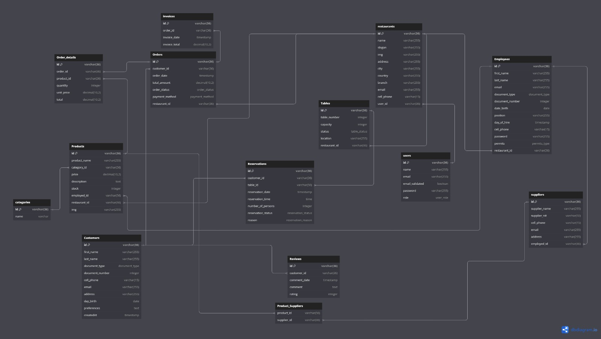

### Reporte 26-09-2024

1. Avance en la definición total de la base de datos para el CRM.

# Modelo de BD

2. Diseño previo para la pagina web JMG(aportes de jesus, ronaldo y teniendo en cuenta el documento enviado por el arquitecto Yair encargado de los logotipos, fuentes entre otros) [ESTRUCTURA DEL SITIO WEB PARA JM GRUPPO GOURMET](/documents/ESTRUCTURA%20DEL%20SITIO%20WEB%20PARA%20JM%20GRUPPO%20GOURMET.pdf). Se va a ir trabajando gradualmente para cumplir los requerimientos por lo que aun no se implementará temas como: _pedidos para llevar_, _reservaciones_(se esta trabajando eso en el crm, pero tiene logica de negocio y lleva su tiempo).
3. Lenguajes y temas técnicos para el desarrollo de sofware se ha definido NodeJS con Typescript para Backend y en frontend como ya se ha mencionado en el informe anterior se usa Angular, y se está usando licencia de código abierto.
4. CRM: Se está trabajando en el módulo de autenticación se espera terminar la proxima semana todo el modulo de autenticación, donde tendremos todas las validaciones para la creación del usuario, quien sera el encargado despues de poder crear los diferentes sitios pertenecientes al gruppo JMG.

